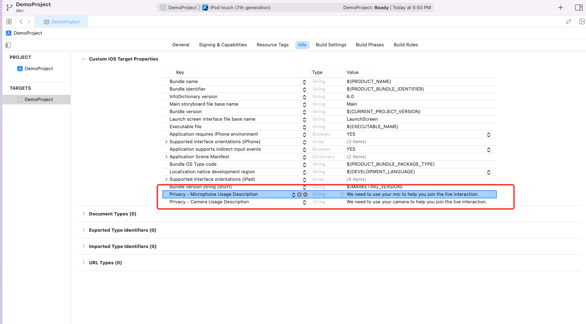

# zego_uikit_prebuilt_video_conference_ios


[](https://discord.gg/EtNRATttyp)

> If you have any questions regarding bugs and feature requests, visit the [ZEGOCLOUD community](https://discord.gg/EtNRATttyp) .


# Quick start

- - -

## Integrate the SDK

[](https://youtu.be/A4E8drD4_xE "Tutorial | How to build video conference using iOS in 10 mins with ZEGOCLOUD")

### Add ZegoUIKitPrebuiltVideoConference as dependencies
- Open Terminal, navigate to your project's root directory, and run the following to create a `podfile`: 
    ```
    pod init
    ```
- Edit the `Podfile` file to add the basic dependency:
    ```
    pod 'ZegoUIKitPrebuiltVideoConference'
    ```
- In Terminal, run the following to download all required dependencies and SDK with Cocoapods:
    ```
    pod install
    ```

### Import ZegoUIKitSDK & ZegoUIKitPrebuiltVideoConference to your project

<pre style="background-color: #011627; border-radius: 8px; padding: 25px; color: white"><div>
import ZegoUIKitSDK
import ZegoUIKitPrebuiltVideoConference
// YourViewController.swift
class ViewController: UIViewController {
    //Other code...
}
</div></pre>

### Using the ZegoUIKitPrebuiltVideoConferenceVC in your project

- Go to [ZEGOCLOUD Admin Console\|_blank](https://console.zegocloud.com/), get the `appID` and `appSign` of your project.
- Specify the `userID` and `userName` for connecting the Video Conference Kit service. 
- Create a `conferenceID` that represents the conference you want to start. 

<div class="mk-hint">

- `userID` and `conferenceID` can only contain numbers, letters, and underlines (_). 
- Using the same `conferenceID` will enter the same video conference.
</div>

<pre style="background-color: #011627; border-radius: 8px; padding: 25px; color: white"><div>
// YourViewController.swift
class ViewController: UIViewController {
    // Other code...
    var userID: String = <#UserID#>
    var userName: String = <#UserName#>
    var conferenceID: String = <#ConferenceID#>

    @IBAction func enterMeeting(_ sender: Any) {
        
        let config: ZegoUIKitPrebuiltVideoConferenceConfig = ZegoUIKitPrebuiltVideoConferenceConfig()
        let layout: ZegoLayout = ZegoLayout()
        layout.mode = .gallery
        let layoutConfig = ZegoLayoutGalleryConfig()
        layout.config = layoutConfig
        config.layout = layout
        config.useSpeakerWhenJoining = true
        let bottomMenuBarConfig: ZegoBottomMenuBarConfig = ZegoBottomMenuBarConfig()
        bottomMenuBarConfig.style = .dark
        config.bottomMenuBarConfig = bottomMenuBarConfig
        let topMenuBarConfig: ZegoTopMenuBarConfig = ZegoTopMenuBarConfig()
        topMenuBarConfig.buttons = [.switchCameraButton,.showMemberListButton]
        config.topMenuBarConfig = topMenuBarConfig
    
        let videoConferenceVC: ZegoUIKitPrebuiltVideoConferenceVC = ZegoUIKitPrebuiltVideoConferenceVC.init(appID, appSign: appSign, userID: userID, userName: userName, conferenceID: conferenceID, config: config)
        videoConferenceVC.modalPresentationStyle = .fullScreen
        self.present(videoConferenceVC, animated: true, completion: nil)
    }
}

</div></pre>

Then, you can start a video conference by presenting the `VC`.


## Configure your project


Open the `Info.plist`, add the following code inside the `dict` part:

```plist
<key>NSCameraUsageDescription</key>
<string>Access permission to camera is required.</string>
<key>NSMicrophoneUsageDescription</key>
<string>Access permission to microphone is required.</string>
```




## Run & Test

Now you have finished all the steps!

You can simply click the **Run** in XCode to run and test your App on your device.


## Related guide

[Custom prebuilt UI](!VideoConferenceKit_Custom_prebuiltUI)

## Resources

<div class="md-grid-list-box">
  <a href="https://github.com/ZEGOCLOUD/zego_uikit_prebuilt_video_conference_example_ios" class="md-grid-item" target="_blank">
    <div class="grid-title">Sample code</div>
    <div class="grid-desc">Click here to get the complete sample code.</div>
  </a>
</div>
